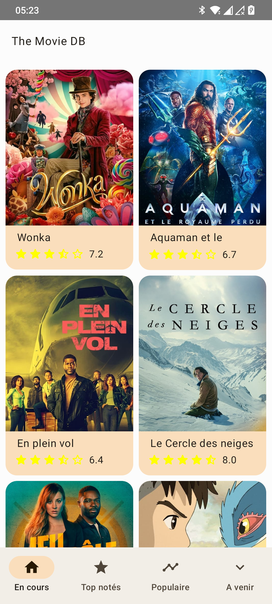
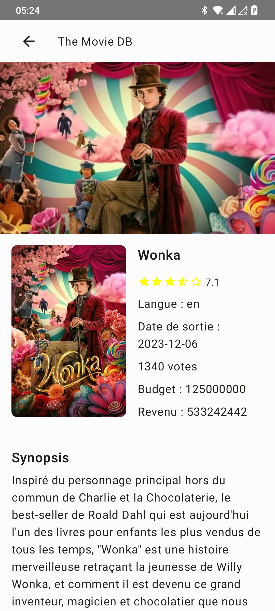
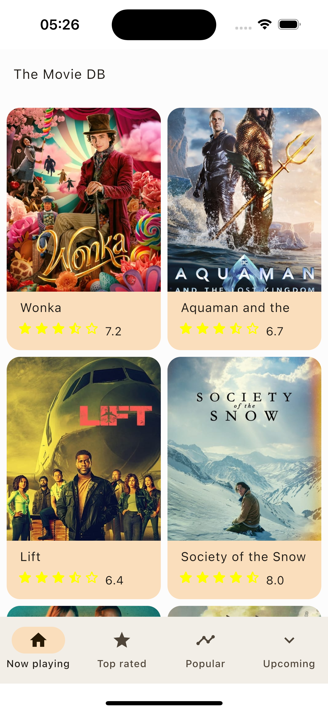
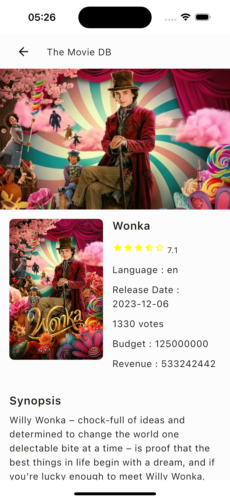

# The Movie DB (Compose Multiplatform)

[](https://github.com/JetBrains/compose-multiplatform/releases/latest)


[](https://kotlinlang.org)
[](https://www.apache.org/licenses/LICENSE-2.0)
<a href="https://github.com/ibenabdallah"></a>

The Movie DB app using [The Movie DB](https://www.themoviedb.org) built with Kotlin Multiplatform & Compose Multiplatform.<br>

# Platform :iphone:

- iOS
- Android

<p float="left">
  
  
  
  
</p>


## Built With 🛠

- [Android Studio](https://developer.android.com/studio/intro) - Android Studio is the official Integrated Development Environment (IDE) for Android app development.
- [XCode](https://developer.apple.com/xcode/) - Xcode 15.2 includes everything you need to develop, test, and distribute apps across all Apple platforms.
- [Kotlin Multiplatform Mobile](https://kotlinlang.org/docs/multiplatform-get-started.html) - The Kotlin Multiplatform technology, to use it you must integrate the following plugins [plugin](https://plugins.jetbrains.com/plugin/14936-kotlin-multiplatform-mobile)
- [Compose Multiplatform](https://github.com/JetBrains/compose-multiplatform) - Compose Multiplatform, a modern UI framework for Kotlin that makes building performant and beautiful user interfaces.
- [kotlinx.serialization](https://github.com/Kotlin/kotlinx.serialization) - Kotlin multiplatform / multi-format reflectionless serialization
- [Coroutines](https://kotlinlang.org/docs/reference/coroutines-overview.html) - For asynchronous and more.
- [Flow](https://kotlin.github.io/kotlinx.coroutines/kotlinx-coroutines-core/kotlinx.coroutines.flow/-flow/) - A cold asynchronous data stream that sequentially emits values and completes normally or with an exception.
- [PreCompose](https://github.com/Tlaster/PreCompose) - Compose Multiplatform Navigation && State Management
- [Ktor Client](https://ktor.io/docs/welcome.html) - Ktor includes a multiplatform asynchronous HTTP client, which allows you to make requests and handle responses.
- [Koin](https://github.com/InsertKoinIO/koin) - Koin a pragmatic lightweight dependency injection framework for Kotlin & Kotlin Multiplatform.
- [Coil3](https://github.com/coil-kt/coil/tree/3.x) - An image loading library for Android backed by Kotlin Coroutines for Kotlin Multiplatform.
- [Moko mvvm](https://github.com/icerockdev/moko-mvvm) - Model-View-ViewModel architecture components for mobile (android & ios) Kotlin Multiplatform development.
- [Paging](https://github.com/cashapp/multiplatform-paging) - A library that adds additional Kotlin Multiplatform targets to AndroidX Paging, and provides UI components to use Paging on iOS.
- [Kermit](https://github.com/touchlab/Kermit) - Kermit is a Kotlin Multiplatform centralized logging utility
- [BuildKonfig](https://github.com/yshrsmz/BuildKonfig) - Supports embedding values from gradle file.

:information_source: Note, I used some libs which are not yet in stable version, it remains as a sample project.

## Architecture :toolbox:

- Clean Architecture 
- MVVM Architecture

## Project structure :bow_and_arrow:

The project follows the standard Kotlin Multiplatform structure, with the following notable files and directories, that targeting Android, iOS.

* [`composeApp`](/composeApp) Contains the project configuration.
  - [`src/commonMain`](/composeApp/src/commonMain) This is a Kotlin module that contains the logic common for both Android and iOS applications, the code you share between platforms.
    This shared module is also where you write your Compose Multiplatform code. In `composeApp/src/commonMain/kotlin/AppScreen.kt`, you can find the shared root `@Composable` function for your app.
    It uses Gradle as the build system. You can add dependencies and change settings in `composeApp/build.gradle.kts`. The shared module builds into an Android library and an iOS framework..
  - [`src/androidMain`](/composeApp/src/androidMain) Contains the Android-specific code and specific configuration files.
  - [`src/iosMain`](/composeApp/src/iosMain) Contains the iOS-specific code.

* [`iosApp`](/iosApp) Contains the iOS-specific configuration files.

* [`build.gradle.kts`](/composeApp/build.gradle.kts) The main Gradle build script for the project.

## Getting Started 🛠

1. Clone this repository to your local machine.
    ```text
    git clone https://github.com/ibenabdallah/the-movie-db.git
    ```

2. Open the project in Android Studio.

3. Set up your Android and iOS device/emulator/simulator.

4. You must create an account on the site [The Movie DB](https://www.themoviedb.org) to create a key afterwards, then set up the `local.properties` file in the project's root directory (if it doesn't already exist) by adding the following properties :

```properties
api_key=<YOUR TMDB API KEY>
```

5. Build and run the project.

## Run project on Different Platforms 🚀

### Android
To run the application on android device/emulator:
- open project in Android Studio and run imported android run configuration

To build the application bundle:
- run `./gradlew :composeApp:assembleDebug`
- find `.apk` file in `composeApp/build/outputs/apk/debug/composeApp-debug.apk`

### iOS
To run the application on iPhone device/simulator:
- Open `iosApp/iosApp.xcproject` in Xcode and run standard configuration
- Or use [Kotlin Multiplatform Mobile plugin](https://plugins.jetbrains.com/plugin/14936-kotlin-multiplatform-mobile) for Android Studio


## Contributing :writing_hand:

Contributions are welcome! If you find any issues or have suggestions for improvements, please open an issue or submit a pull request. Please ensure that your contributions adhere to the project's coding style and guidelines.


## Contributors 📢

<a href="https://github.com/ibenabdallah/the-movie-db/graphs/contributors">
    
</a>

## License :spiral_notepad:

This project is licensed under the [MIT License](LICENSE).

## Connect with me :man_shrugging:

[](https://www.linkedin.com/in/ibenabdallah/)
[](https://twitter.com/Ingbaismail)
